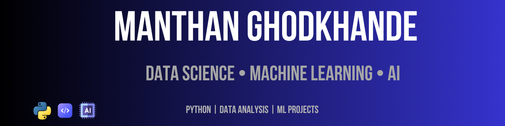

<h3 align="center">Aspiring Data Scientist | Machine Learning Enthusiast</h3>

---

## 🚀 About Me
- 🎓 Data Science learner
- 💻 Programming in **Python, C, C++**
- 📊 Interested in **Machine Learning, AI, and Data Analysis**
- 🧠 Currently learning **Machine Learning & Data Science**
- 🏋️ Gym enthusiast

---

## 🧰 Tech Stack

 

 
 

---

## 📂 Featured Projects

🔹 **Titanic Survival Prediction**  
Machine Learning model predicting passenger survival.

🔹 **Data Cleaning with Python**  
Real dataset cleaning using Pandas.

🔹 **Exploratory Data Analysis**  
Data visualization and pattern discovery.

---

## 📊 GitHub Stats

---

## 📈 Activity Graph

---

## 🌱 Currently Learning

- Machine Learning Algorithms
- Data Visualization
- Feature Engineering
- Model Evaluation

---

## 🤝 Connect With Me

- GitHub
- LinkedIn
- YouTube (coming soon)

---

⭐ From Manthan
